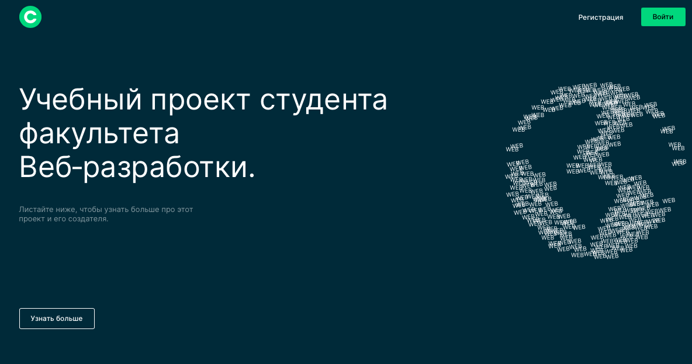

## Веб-приложение "Фильмы" 🎥

Это **НЕВЫПУСКНАЯ** работа на курсах ЯндексПрактикума

Это проект с бэком и фронтом, адаптивной версткой. 
На этом сайте пользователи могут:
- [X] зарегестрироваться
- [X] авторезоваться
- [X] найти фильмы по поиску из базы данных, 
- [X] отфильтровать фильмы по длительности 
- [X] сохранить в избранное или удалить
- [X] отредактировать данные пользователя.

Работа версталась по определенному макету - [dark-4](https://www.figma.com/file/6FMWkB94wE7KTkcCgUXtnC/Дипломный-проект?type=design&node-id=1-9662&mode=design&t=pdg8ikfECAEn5j8R-0)

Требования к диплому прописаны в [ТЗ](https://code.s3.yandex.net/web-developer/static/new-program/web-diploma-criteria-2.0/index.html#js)

Проект был сформирован и задеплоен на Яндекс.Облако, а адаптировав под себя по вебинару эта история оооочень [упросила работу](https://www.notion.so/8e79d27ff30d4855add7ddbfccf7a968)

*Если хотите посомтреть видео, жмите на картинку👇*

### Используемые технологии:<h3>

    

 

